# FinView

Django 기반 금융 커뮤니티 서비스 프로젝트
사용자 인증 기능과 게시글 작성·수정·조회가 가능한 게시판을 포함

## 1. 기술 스택

- Python 3.11
- Django 5.2.8
- SQLite3
- 가상환경: venv

## 2. 주요 기능
### 2.1 사용자 인증 (accounts 앱)
- 로그인
- 로그아웃
- 회원가입
- 회원탈퇴
- 회원정보 수정
- 비밀번호 변경

### 2.2 게시글 기능 (posts 앱)
- 게시글 조회
- 게시글 생성
- 게시글 수정
- 게시글 삭제
- 댓글 생성
- 댓글 삭제

## 3. 컨벤션
### 3.1 커밋 메시지
- 기능 : `feature-01-login`
- 수정 : `fix-01-login`
- 참고 : [참고블로그](https://sungwookoo.tistory.com/1)

### 3.2 브랜치명
- 기능 : `feature/login` 이런식으로 이름 정하기

## 4. 브랜치 용도
- master: 최종 프로젝트
- develop: 개발 중 병합 브랜치
- fearure/user-model: F02 - 모델 상속
- feature/form-custom: F03 - 기본 폼 CUSTOM
- feature/login: F07 - 로그인
- feature/logout: F08 - 로그아웃
- fearure/signup: F09 - 회원가입
- feature/delete: F11 - 회원탈퇴
- feature/index: F13 - 금융 게시글 조회
- feature/detail: F15 - 게시글 상세 조회
- fearure/update: F16 - 게시글 수정
- fix/authenticated: 인증된 사용자에 의한 접근 제한
- docs/readme: 리드미 파일 수정

## 5. 커밋 내역
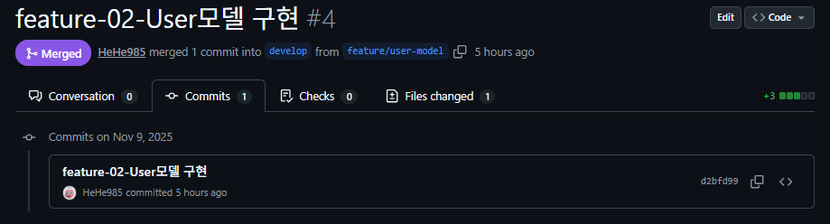
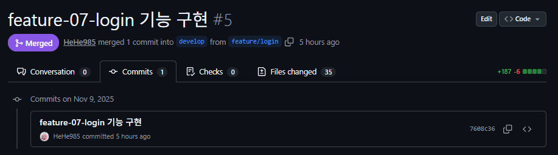
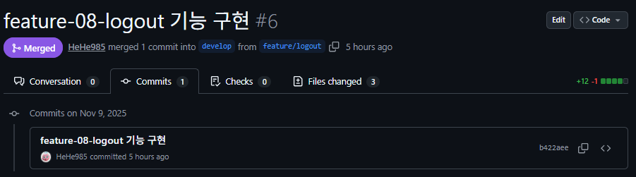
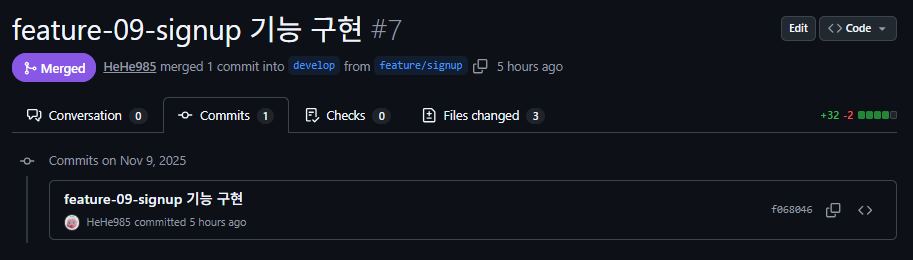
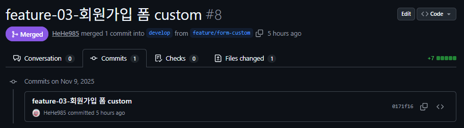
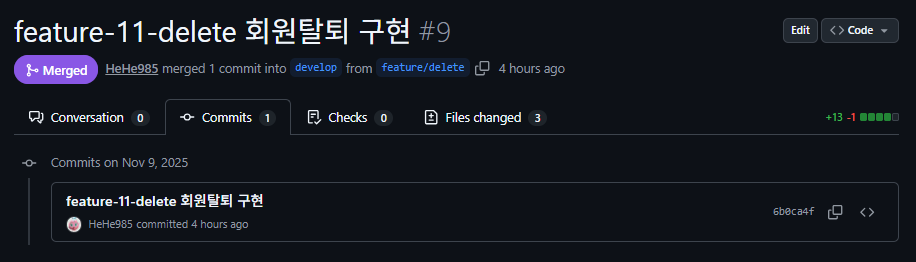
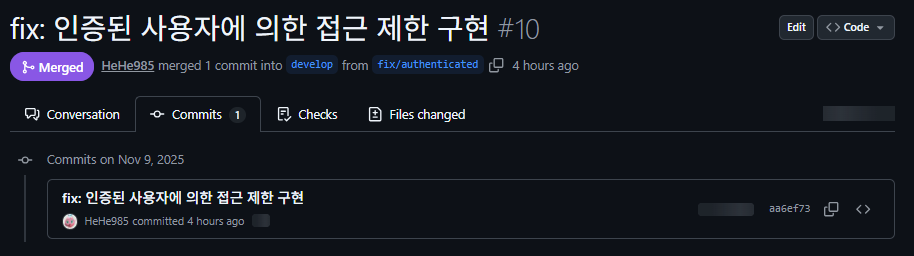
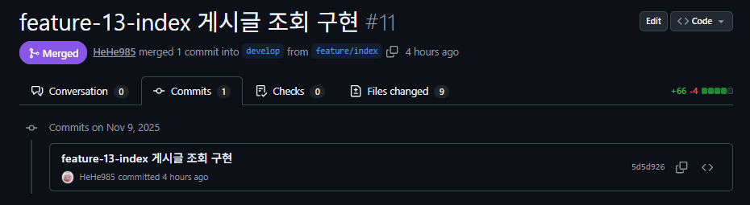
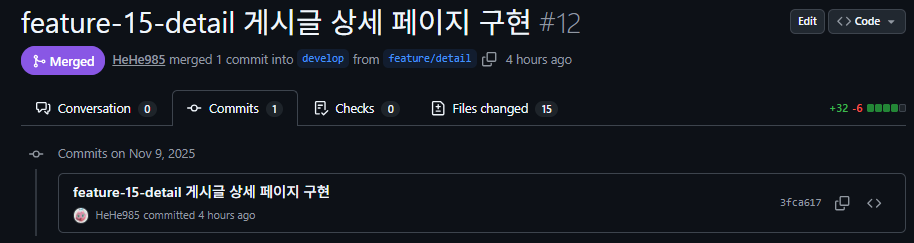
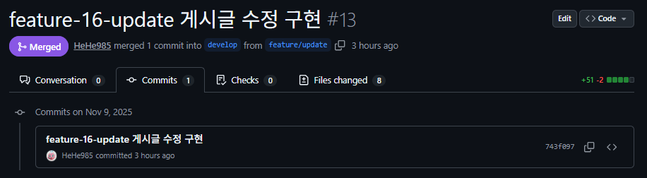
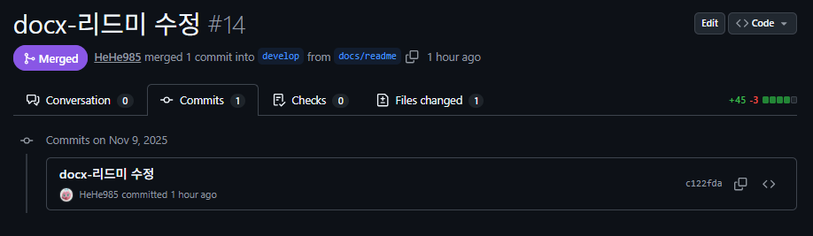