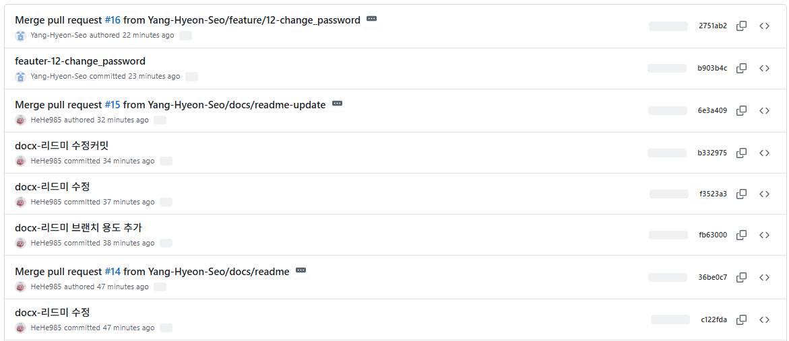
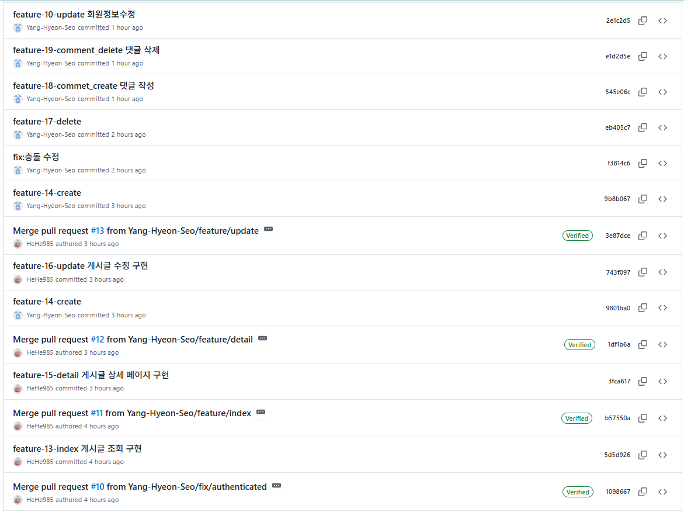
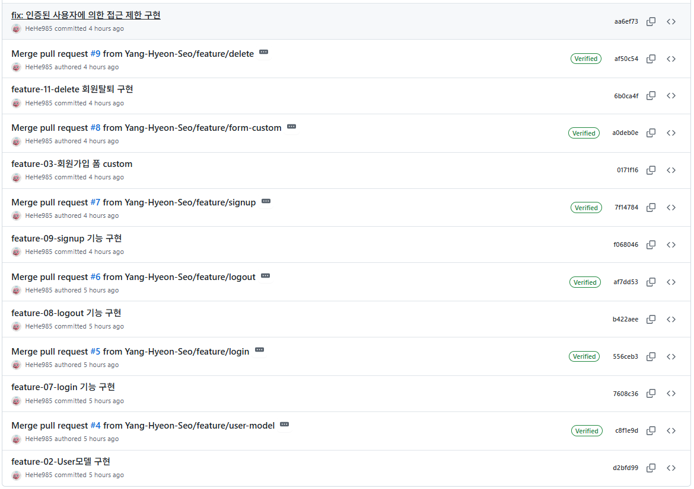
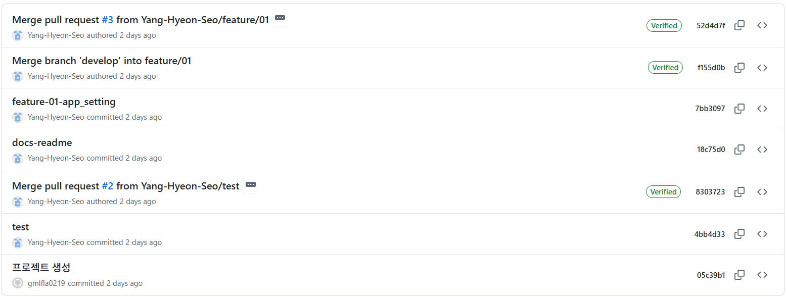

# FinView

Django 기반 금융 커뮤니티 서비스 프로젝트
사용자 인증 기능과 게시글 작성·수정·조회가 가능한 게시판을 포함

## 1. 기술 스택

- Python 3.11
- Django 5.2.8
- SQLite3
- 가상환경: venv

## 2. 주요 기능
### 2.1 사용자 인증 (accounts 앱)
- 로그인
- 로그아웃
- 회원가입
- 회원탈퇴
- 회원정보 수정
- 비밀번호 변경

### 2.2 게시글 기능 (posts 앱)
- 게시글 조회
- 게시글 생성
- 게시글 수정
- 게시글 삭제
- 댓글 생성
- 댓글 삭제

## 3. 컨벤션
### 3.1 커밋 메시지
- 기능 : `feature-01-login`
- 수정 : `fix-01-login`
- 참고 : [참고블로그](https://sungwookoo.tistory.com/1)

### 3.2 브랜치명
- 기능 : `feature/login` 이런식으로 이름 정하기

## 4. 브랜치 용도
- master: 최종 프로젝트
- develop: 개발 중 병합 브랜치
- fearure/user-model: F02 - 모델 상속
- feature/form-custom: F03 - 기본 폼 CUSTOM
- feature/login: F07 - 로그인
- feature/logout: F08 - 로그아웃
- fearure/signup: F09 - 회원가입
- feature/delete: F11 - 회원탈퇴
- feature/index: F13 - 금융 게시글 조회
- feature/detail: F15 - 게시글 상세 조회
- fearure/update: F16 - 게시글 수정
- fix/authenticated: 인증된 사용자에 의한 접근 제한
- feature/10-update : F10 - 회원 정보 수정
- feature/12-change_password : F12 - 비밀번호 변경
- feature/14-create : F14 - 게시글 작성
- feature/17-delete : F17 - 게시글 삭제
- feature/18-comment_create : F18 - 댓글 작성
- feature/19-comment_delete : F19 - 댓글 삭제

## 5. 커밋





## 6. 코드 소개
- post/create
  - 게시글 작성 가능
  - 문제 상황 : 기능 개발 과정에서 중간중간 오류가 나는 경우가 많았고, 코드 작성 과정에서 각 코드가 어떻게 연결되는지 다시 확인해야 했음
  - 문제 해결 방법 : 강의 자료를 다시 읽으면서 이론적으로 놓친 부분이 어디인지 점검하고, 실수한 부분을 찾았음
  - 문제 원인 : 
    1. 강의 자료를 참고하여 수정하는 과정에서 변수명에서 실수가 있었음
    2. forms.py를 작성하지 않음
    3. model 작성 시 외래키를 제대로 적용하지 않음
    4. 실행 테스트를 쉽게 하기 위해 `@login_require` 코드를 지우고 진행하려고 했는데, 이 과정에서 오류 발생
  - ```python
      # models.py
      class Article(models.Model):
          user = models.ForeignKey(settings.AUTH_USER_MODEL, on_delete=models.CASCADE)
          title = models.CharField(max_length=100)
          content = models.TextField()
          created_at = models.DateTimeField(auto_now_add=True)
          updated_at = models.DateTimeField(auto_now=True)
      ```
  - ``` python
      # view.py
      @login_required
      def create(request):
          # title = request.GET.get('title')
          # content = request.GET.get('content')

          # post = Article(title=title, content=content)
          # article.save()

          if request.method == 'POST':
              form = ArticleForm(request.POST)
              if form.is_valid():
                  article = form.save(commit=False)
                  article.user = request.user
                  article.save()
                  return redirect('posts:index') #, article.pk)
          else:
              form = ArticleForm()
          context = {
              'form': form,
          }
          return render(request, 'posts/create.html', context)
        ```
  - ``` python
      # forms.py
      class ArticleForm(forms.ModelForm):
        class Meta:
            model = Article
            # fields = '__all__'
            fields = ('title', 'content',)
      ```

- 비밀번호 수정
  - 코드 작성 및 수정 과정이 가장 어려웠음
  - 문제 상황 : 비밀번호 수정을 진행해도 비밀번호가 바뀌지 않음
  - 문제 해결 방법 : AI 어시스턴트에게 질문 및 인터넷 조사를 통해 문제 원인 파악 및 수정
  - 문제 원인 : 비밀번호 수정을 위해서는 기존 비밀번호 확인, 새로운 비밀번호 입력, 새 비밀번호 확인의 3가지가 필요했는데, 새로운 비밀번호 입력만 받고 있었음
    - 기술 블로그 포스팅을 참고하여 문제를 해결함 
  - ```python
      # accounts/views.py
      from django.contrib.auth.forms import AuthenticationForm, PasswordChangeForm
      from django.contrib.auth import update_session_auth_hash

      @login_required
      def change_password(request):
          
          if request.method == 'POST':
              form = PasswordChangeForm(request.user, request.POST)

              if form.is_valid():
                  user = form.save()
                  update_session_auth_hash(request, user)
                  messages.success(request, '비밀번호가 성공적으로 변경되었습니다.')
                  return redirect('posts:index')
          else:
              form = PasswordChangeForm(request.user)
          context = {
              'form': form,
          }
          return render(request, 'accounts/change_password.html', context)
      ```
    - PasswordChangeForm, update_session_auth_hash에 대해 조사
      - 비밀번호 변경에 사용하는 폼
      - 장고는 sha256을 사용해 암호화를 진행해 해시 값을 가짐
      - 이 둘을 이용하여 비밀번호 변경이 가능함
  - ``` html
      <body>
        <h1>비밀번호 변경</h1>
        <form action="" method="POST">
          
           <label for="password">
            <input type="password" id="password" name="password">
            <input type="submit" value="비밀번호 변경">
          </label> 
          {{ form }}

           <label for="old_password">현재 비밀번호:</label>
          <input type="password" id="old_password" name="old_password">
          <label for="new_password">새 비밀번호:</label>
          <input type="password" id="new_password" name="new_password">
          <label for="new_password_confirm">새 비밀번호 확인:</label>
          <input type="password" id="new_password_confirm" name="new_password_confirm"> 

          <input type="submit" value="비밀번호 변경">
        </form>
        <a href="">[back]</a>
      </body>
      ```
    - form을 만들 때, 하나씩 만들고 싶었는데, 원하는대로 잘 안되어서 `{{ form }}`으로 한 번에 입력 받음
    - 기술 블로그를 참고하여 하나씩 나눠 받을 수 있는 form을 주석으로 추가함 (나중에 해당 방법을 적용해보기 위함)

## 7. 배운점 및 느낀점
- 현서
  - 코드 작성을 위해 과거 강의 복습을 진행함
    - 이 과정에서 내가 놓쳤던 부분을 다시 확인할 수 있었고
    - 그 덕분에 지금까지 이해가 안되었던 부분을 이해할 수 있게 되었다!
  - 깃 허브 이용이 어렵다!
    - 깃 허브를 이용해 협업을 진행했는데, 계속 PR이 진행되지 않았다는 문제가 있었다
    - commit을 작성한 후에 브랜치를 develop로 바꾸고 merge를 진행한 후에 push를 진행했기 때문이었다는 것을 알게 되었다
    - 순서가 잘못 되었었고, 희림님께서 알려주신 덕분에 PR을 진행할 수 있게 되었다!
  - 코드를 작성하는 과정에서 협업으로 진행하다 보니까 처음에 어떻게 진행해야 할지 막막했었는데, 그래도 진행을 하다 보니까 어느정도 감을 잡을랑 말랑이라서 조금 더 도전해보면 좋겠다는 생각이 들었다
    - 처음에 merge를 진행할 때 충돌이 많이 났는데, 해결하려니까 너무 어렵고 막막해서 진짜 포기하고 싶었는데, 그래도 한 번 문제를 해결해 보니까 약간은 알 것 같다는 생각이 들었다!